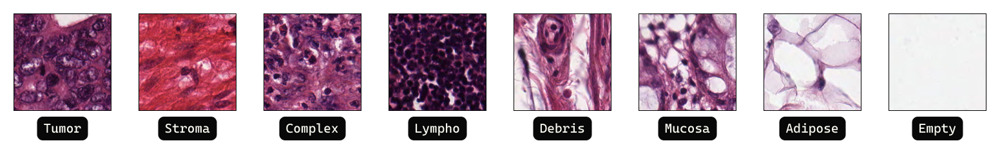
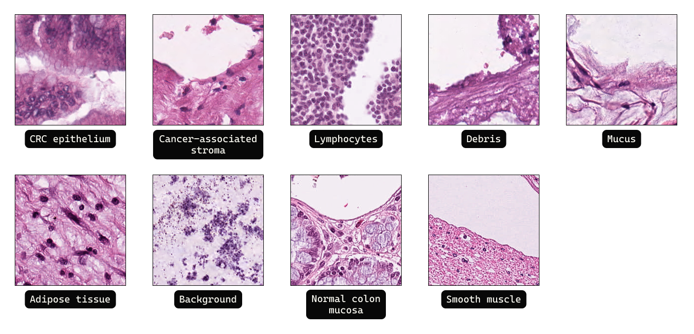

# Master thesis

## Classification performance analysis of medical histopathology images using deep neural networks

>💡 This repository contains Jupyter Notebooks and Python scripts used during master thesis research.
- [Thesis](https://dabar.srce.hr/islandora/search/bo%C5%BEo%20durdov?type=dismax)
- [Thesis Presentation](./etc/250_23-24_Durdov-Božo_516-2022_Master_Thesis_presentation.pdf)

### Repository structure

    .
    ├── notebooks                   # Jupyter Notebooks
    ├── etc
    │   ├── diagrams                # draw.io diagrams 
    │   ├── pseudocode              # LaTeX code for iterative algorithm
    │   └── ...
    └── README.md

### Jupyter Notebooks

1. Data_preview
   - Downloads the datasets
   - Prints the samples from each dataset
2. Data_preprocessing
   - Converting images from .tif into .png
   - Resizing images
   - Datasets merge
3. Training
   - Train and save models for model/dataset combinations
4. Testing
   - Load saved models and evaluate them
   - Store evaluation results for future analyze without loading datasets/models
   - Analyze the evaluation results
5. Iterative V1
   - Single shared test set iterative algorithm implementation
   - Train and analyzis included

>⚠️ Some notebooks use the results of the previous ones so they need to be executed in order.

## Datasets (Human Colorectal Cancer Histological Images)

| Dataset name         | URL data                                   | URL paper                                                                                  | Size   | Resolution | Classes | Balanced | Stain normalization |
| -------------------- | ------------------------------------------ | ------------------------------------------------------------------------------------------ | ------ | ---------- | ------- | -------- | ------------------- |
| Colorectal Histology | [Link](https://zenodo.org/record/53169)    | [kather16](https://www.nature.com/articles/srep27988)                                      | 5000   | 150x150    | 8       | Yes      | No                  |
| NCT-CRC-HE-100K      | [Link](https://zenodo.org/records/1214456) | [kather19](https://journals.plos.org/plosmedicine/article?id=10.1371/journal.pmed.1002730) | 100000 | 224x224    | 9       | No       | Yes                 |
| CRC-VAL-HE-7K        | [Link](https://zenodo.org/records/1214456) | [kather19](https://journals.plos.org/plosmedicine/article?id=10.1371/journal.pmed.1002730) | 7180   | 224x224    | 9       | No       | Yes                 |

### Random samples from datasets

   
   

      <em>Colorectal Histology</em>
   

---

   
   

      <em>NCT-CRC-HE-100K dataset</em>
   

